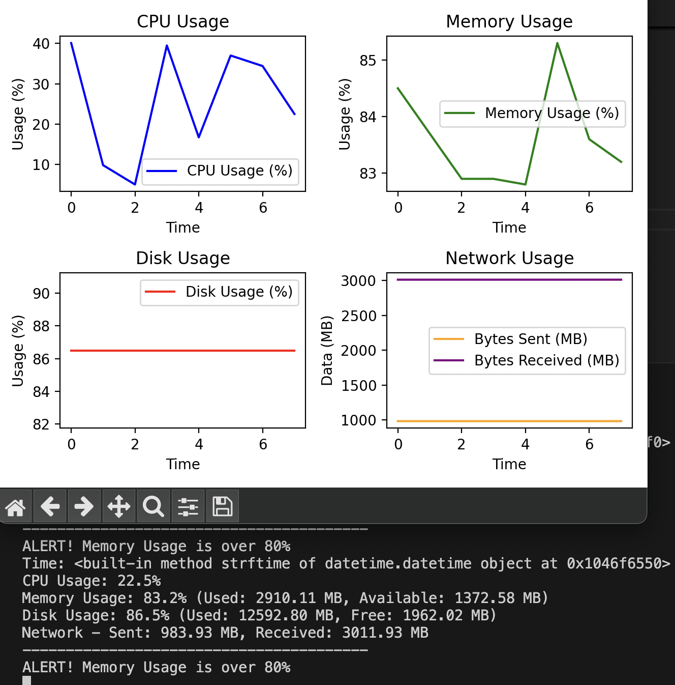

# 🖥️ System Health Checker 🚀

A simple Python tool that monitors and logs system health data (CPU, Memory, Disk, Network) in real-time and generates visual plots. 📊

## 📋 Features
- ⚡ Real-time monitoring of CPU, memory, disk, and network usage
- 📝 Logs data to CSV file
- 📉 Live plotting of system stats
- 🚨 Alerts when system resources are above specified thresholds

## 💻 Installation


1. Clone the repository:
    ```bash
    git clone https://github.com/yourusername/python_project2.git
    ```
2. Install required dependencies:
    ```bash
    pip install -r requirements.txt
    ```
## 📸 Screenshot

Here is a sample output of the system health checker:


## 🚀 Contribution

We welcome contributions to make this project even better! If you'd like to contribute, please follow these steps:

1. Fork the repository by clicking the "Fork" button at the top-right of this page.
2. Clone your fork to your local machine:
    ```bash
    git clone https://github.com/yourusername/python_project2.git
    ```
3. Create a new branch for your feature or bug fix:
    ```bash
    git checkout -b feature-name
    ```
4. Make your changes and commit them:
    ```bash
    git commit -m "Add a new feature"
    ```
5. Push your changes back to your forked repository:
    ```bash
    git push origin feature-name
    ```
6. Open a pull request (PR) to the original repository.

Your help is appreciated! 🚀


## 🛠️ Usage

To run the health checker:
```bash
python system_health_checker.py


